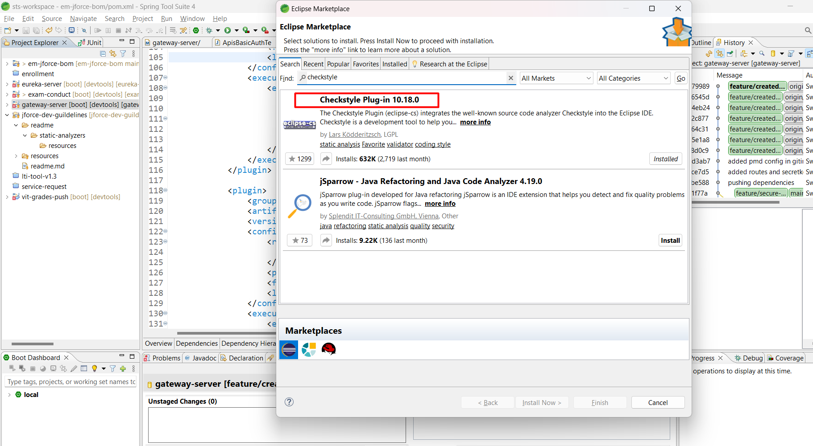
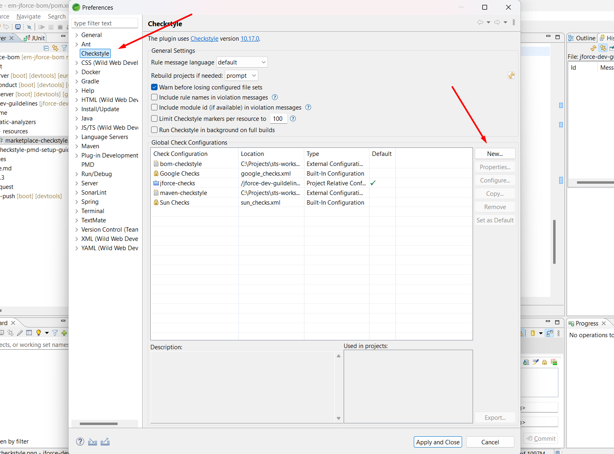
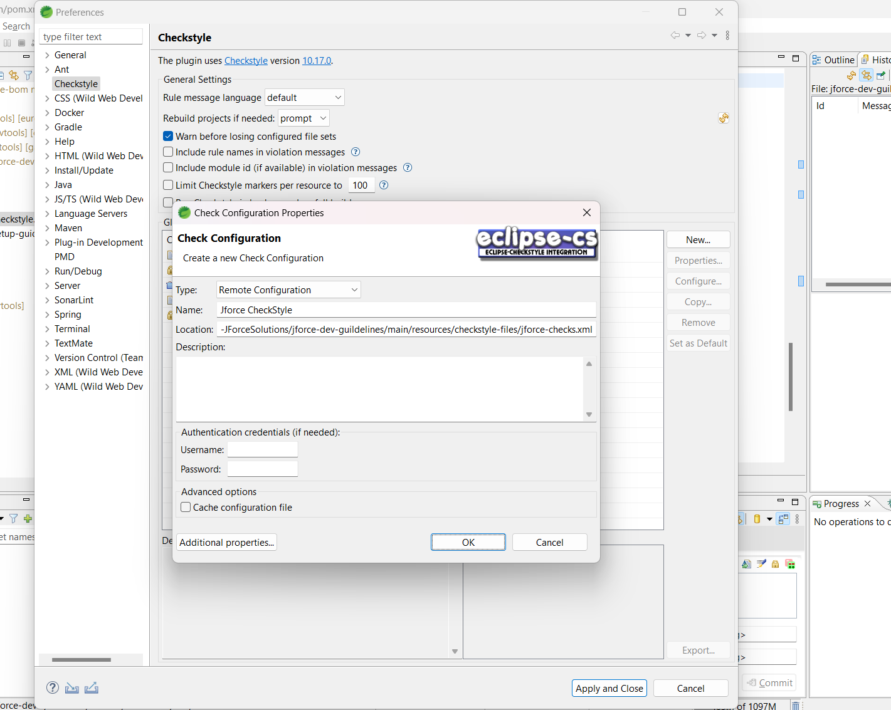
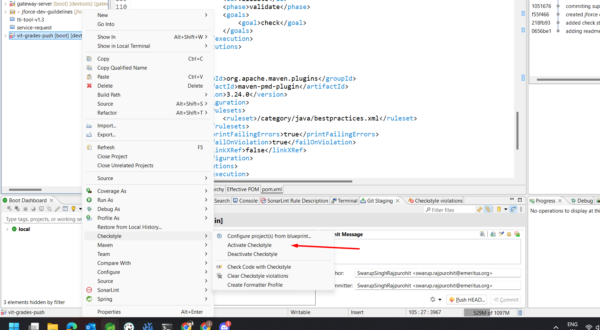
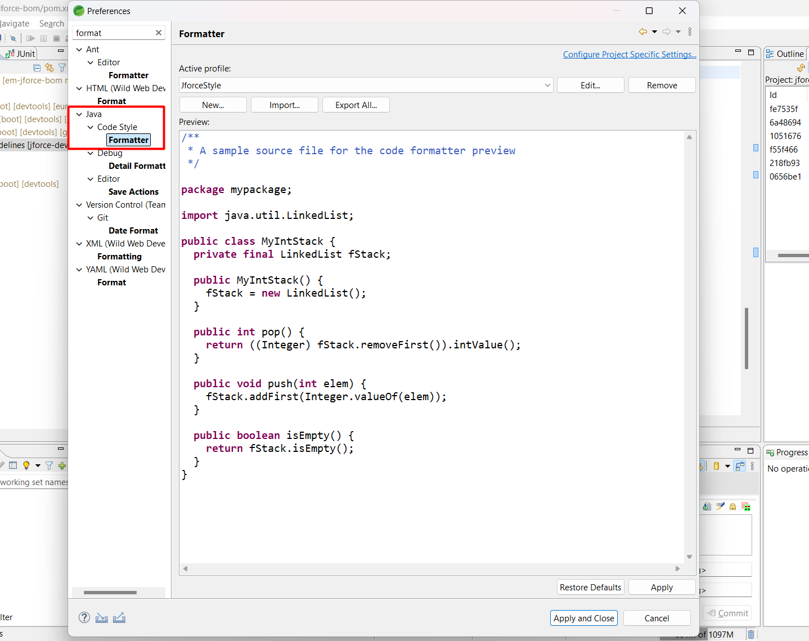

## Setup Checkstyle

* Checkstyle is a code quality tool static analyzer that ensures certain styles were followed.

* To setup the project first clone the repository:

```git clone git@github.com:Emeritus-JForceSolutions/jforce-dev-guildelines.git```

* Import it in Eclipse / STS as a project.

### To setup in Eclipse / STS

* Ensure your project is a child of BOM.
* By default check style check is applied for projects and is built in with maven install.
* To see the error in Editor while programming install the STS / Eclipse plugin.



* Now by default checkstyle has google and sun checks but we'll add our own to cosutomize later.

* Goto Window > Preferences and search for checkstyle there.



* Click on "New" to add new
* From the dropdown select "Remote Configuration"
* Name it "Jforce Checkstyle" or something like that.
* Now in the URL add the following:
    - https://raw.githubusercontent.com/Emeritus-JForceSolutions/jforce-dev-guildelines/main/resources/checkstyle-files/jforce-checks.xml

* You might be prompted to resolve errors, you can check for those if these are supression files, ignore (for now) and continue anyway.



* Once the checkstyle is added, click on it and then click on set as default.

* After it is set, click on project you want to apply checkstyle to and click on activate.



* You may have to full build the project for the plugin to take full effect.


## Setup Formatter to Support the Checkstyle

* Since we have setup Checkstyle we have to tweak the formatter accordingly.

* We are going to import the settings so if you have jforce-dev-guidelines project setup there's file in jforce-dev-guidelines/resources/formatters/jforce-formatter.xml.

* or you can download it from the URL and use that:
 - https://github.com/Emeritus-JForceSolutions/jforce-dev-guildelines/blob/main/resources/formatters/jforce-formatter.xml

* To setup the formatter goto Window > Preferences > Java > Code Style > Formatter




* Click on import and select the XML file.

* You should be able to format your way to align with the checkstyle.

